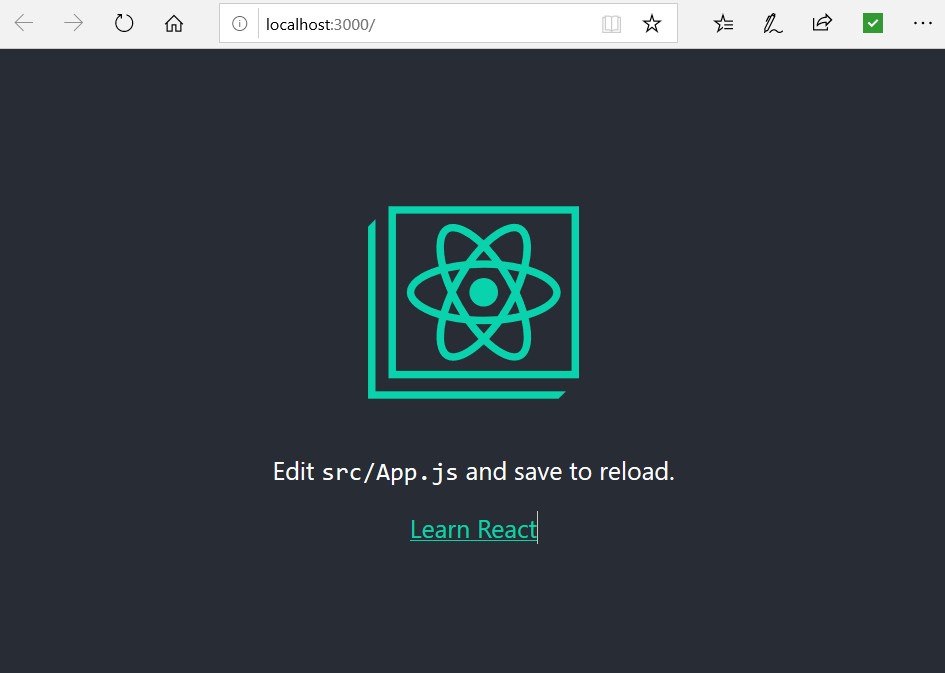

# The React part of the Django/React Tutorial. 

This is the React part of the Django/React Tutorial.
It is assumed you have completed this Django part of the tutorial.
https://github.com/redcricket/react_django_tut_with_auth/blob/master/README_setup.md

I am using WebStorm (30-day) trail edition on a Windows 10 system.

# Install Node.js

Ensure you have Node.js and npm installed.  Documentation for doing this is availabe here. 
https://nodejs.org/en/

In the WebStorm terminal I execute:

```
C:\Users\plankton\WebstormProjects\react_django_tut_with_auth_fe>node -v
v10.16.3

C:\Users\plankton\WebstormProjects\react_django_tut_with_auth_fe>npm -v
6.9.0
```

# Create React App

In the terminal execute:

```
C:\Users\plankton\WebstormProjects\react_django_tut_with_auth_fe>npx create-react-app react_django_tut_with_auth
```

This will take a minute of two.

Next we can QA the install by executing:

```
C:\Users\plankton\WebstormProjects\react_django_tut_with_auth_fe>cd react_django_tut_with_auth
C:\Users\plankton\WebstormProjects\react_django_tut_with_auth_fe\react_django_tut_with_auth>npm start
```

And then point your browser to http://localhost:3000/.

You should see this webpage:



# Install TypeScript

In the terminal execute:

```
C:\Users\plankton\WebstormProjects\react_django_tut_with_auth_fe\react_django_tut_with_auth>npm install typescript
```

and do this

```
npm install @types/react
```

also install axios

```
C:\Users\plankton\WebstormProjects\react_django_tut_with_auth_fe\react_django_tut_with_auth>npm install axios
```
